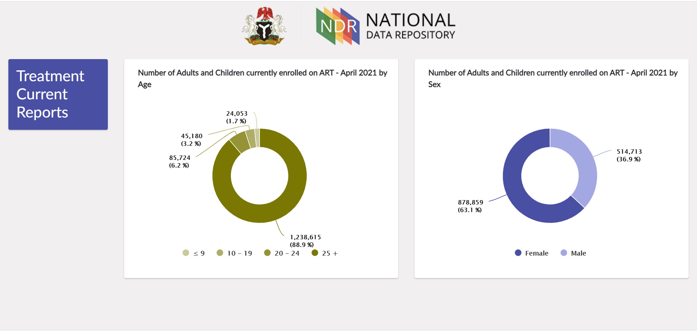
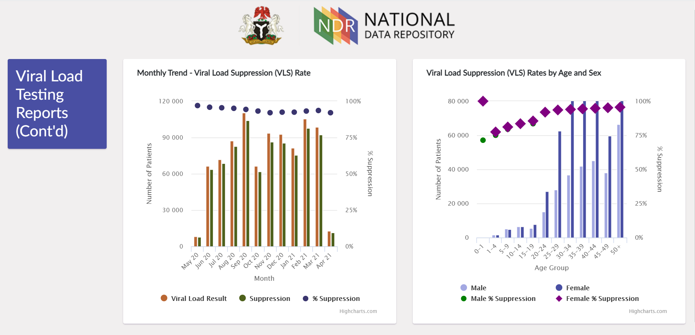
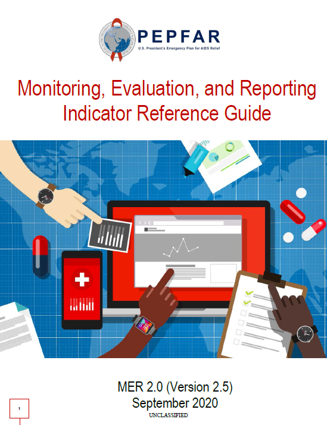
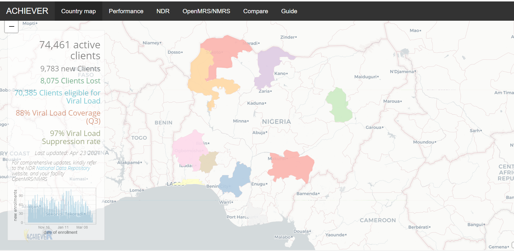
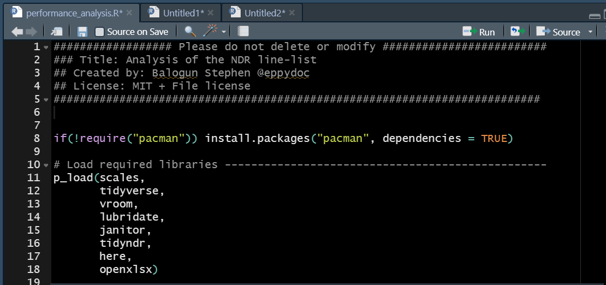

```{r setup, include=FALSE}
options(htmltools.dir.version = FALSE)
knitr::opts_chunk$set(
  fig.width=9, fig.height=3.5, fig.retina=3,
  out.width = "100%",
  cache = FALSE,
  echo = TRUE,
  message = FALSE,
  warning = FALSE,
  fig.show = TRUE,
  hiline = TRUE
)
```


class: chapter-slide

#<span style="font-family: 'Cormorant Upright', serif; text-shadow: 2px 2px #333"> Introduction</span>

???

Hi!

I am Balogun Stephen and thanks for tuning in to my lightning talk on data analysis using the tidyndr
---

## HIV/AIDS - the global pandemic

<br/>
.pull-left[
`r icons::fontawesome("ribbon")` - First case of HIV was detected 40 years ago  

In 2020:

`r icons::ionicons("man")` - 1.5 million new infections   

`r icons::fontawesome("ambulance")` - 690 thousand people died of AIDS-related                                           illnesses

`r icons::ionicons("people")` - 37.6 million people were living with HIV/AIDS  

`r icons::fontawesome("pills")` `r icons::fontawesome("universal-access")` - equitable access remains a challenge.
]

.pull-right[

<left>

</left>

UNAIDS 95-95-95 target by 2030 to achieve epidemiologic control.

+ 95% of people living with HIV know their HIV status   

+ 95% accessing treatment 

+ 95% of persons on treatment virally suppressed 
    
]  


???

- Forty years have passed since the first case of HIV/AIDS. Yet, in the year 2020, 1.5 million people were newly infected with the virus

- 690 thousand people died of AIDS-related illnesses; 37.6 million people were living with HIV/AIDS.

- While remarkable progress has been recorded in the last decade, inequity between and within countries continues to drive the epidemic. Though some countries have attained epidemic control, many are off-track with COVID-19, conflict, and humanitarian emergencies reversing the gains.
- The UNAIDS has set ambitious targets to achieve epidemic control of HIV/AIDS by 2030 through identification of at least 95% of persons living with virus, retaining 95% of those identified on treatment and achieving viral suppression in at least 95% of those on treatment.
---

## Nigeria

.pull-left[
- Estimated 1.9 million people living with HIV.

- In the year 2020:
    
    - 73% of people living with HIV had been diagnosed

    - 89% of those diagnosed were accessing treatment

    - 78% of those accessing treatment were virally suppressed.
    
- Need for data utilization at every level

]


.pull-right[

<left>

</left>

  .footnote[
  <span style="font-size: 9px">
  <i style="font-weight: 600">Source:</i> Revised National HIV and AIDS Strategic Framework 2019-2021, Nigeria
  </span>
  ]
]


???

- Nigeria has the fourth-largest epidemic in the world with an estimated 1.9 million people living with HIV. 

- At the end of 2020, the progress across the three 95s are: 73%-89%- and-78% with varying prevalence and progress across the states as shown by the map

- To achieve the UNAIDS target, granular data at community, local government and sub-population levels must continuously be made available and utilized for informed decision.
---

## The National Data Repository - NDR

- A repository of de-identified patient-level data from facilities across all the states in the country

- Contains records of over 2000 reporting facilities and over 1.3 million PLHIV currently on treatment.

- Restricted access [A public dashboard is available](https://ndr.shieldnigeriaproject.com/public/dashboard).

<br/>

.pull-left[


  .footnote[
  <span style="font-size: 9px">
  <i style="font-weight: 600">Source:</i> The Nigeria National Data Repository (NDR) public dashboard
  </span>
  ]
]

.pull-right[

]

<br/>
<br/>
<br/>


???

- In 2016, through the PEPFAR support, the journey to a National (HIV) Data Repository started. The repository contains the de-identified records of over 1.3 million HIV clients on treatment across the country. 

- This is accessible to persons within the industry to track progress and improve programming at various levels. Linelist of these clients can be downloaded for further analysis and use. 

- The pictures below show snapshot of the NDR public dashboard

---
class: center, middle, chapter-slide, inverse
<br/>
.pull-left[

## <i style="font-family: 'Cormorant Upright', serif"> "It is essential to not only capture high-quality data, but to also continuously use and analyze the data to achieve maximum program impact.The only way to improve data is to use the data” </i>
]

.pull-right[

<center>

</center>

  .footnote[
  <span style="font-size: 9px">
  <i style="font-weight: 600">Source:</i> PEPFAR DATIM
  </span>
  ]

]


???

According to the PEPFAR MER version 2.5,

"It is essential to not only capture high-quality data, but to also continuously use and analyze the data to achieve maximum program impact.The only way to improve data is to use the data”


---
## NDR data use

Analysis is traditionally conducted using spreadsheets. Challenges include:

+   The software must be installed on the user’s computer.

+   The user must be familiar with the formula for calculation of the indicator of interest.

+   Can be quite heavy and difficult to manipulate

+   It is error-prone. Sometimes these errors go unnoticed

+   Periodic analysis can be quite tedious and time-consuming


???

- However, analysis of the downloaded data is traditionally conducted in spreadsheet applications. 

- While these provide a great platform, the downsides include: the software must be installed on the user’s computer, and the user must be familiar with the formula for the calculation. The point-and-click nature makes it error-prone, with difficult reproducibility. Also, performing the same analysis periodically can be quite tedious and time-consuming 
---
class: center, middle, chapter-slide

#<span style="font-family: 'Cormorant Upright', serif; text-shadow: 2px 2px #333"> tidyndr package</span>


???

- A cross-functional team of 7 clinical and data experts came together to put together the {tidyndr} package to support analysis of the NDR patient linelist.
---

## Design

<center>

</center>

.footnote[
    <span style="font-size: 9px; padding-left:50px">
        <i style="font-weight: 600">Artwork by</i> @allison_horst
    </span>
]


???

The package is designed in line with the data science workflow proposed by Hadley Wickham. Varying functions are responsible for importing, tidying, transforming, and summarizing the analysis.
---

## Supporting packages
.pull-left[

- dplyr

- forcats

- janitor

- vroom

- tidyr

- tibble

- lubridate

- magrittr

- purrr

]
.pull-right[


  .footnote[
    <span style="font-size: 9px">
        <i style="font-weight: 600">Artwork by</i> @allison_horst
    </span>
    ]

]


???

Nine tidyverse and tidyverse-related packages were used in the development of the package.
---

## The package

```{r, eval=FALSE}
# from CRAN
install.packages("tidyndr", dependencies = TRUE)

# developmental version from github
devtools::install_github("stephenbalogun/tidyndr", build_vignettes = TRUE)
```

<br/>

.pull-left[
#### Importing function

```
read_ndr()
```
#### Treatment function

```
1. tx_new()
2. tx_curr()
3. tx_appointment()
4. tx_ml()
5. tx_ml_outcomes()
6. tx_rtt()
7. tx_mmd()
```
]

.pull-right[

#### Viral Load functions

```
1. tx_vl_eligible()
2. tx_pvls_den()
3. tx_pvls_num()
4. tx_vl_unsuppressed()
```
#### Summary functions

```
1. summarise_ndr()
2. disaggregate()
```
]


???

- tidyndr can be installed from both github and CRAN

- where possible, the functions are named similar to the PEPFAR program indicators that users are already familiar with

- these functions are grouped into 1 importing function, 7 treatment-related functions, 4 viral load-related functions and 2 summary functions.
---
.pull-left[
## Benefits

+ Fast platform for data analysis and automation of routine projects.

+ Reproducibility - eliminate random errors

+ Scalable to support the analysis of large-volume data

+ Support easy identification of program gaps and those responsible for tailored intervention

+ Provides a foundation upon which other relevant program applications can be built.

<br/>
<i style="font-weight: 600; color: #75aadb">The NDR is still evolving, and the package is planned to evolve alongside</i>

]


.pull-right[
<br/>


<hr/>



]

???

Benefits of the package includes:

+ It provides a fast platform for data analysis and automation of routine projects.

+ Analysis conducted using the package is reproducible

+ It can be used to analyse large volume of data

+ It supports easy identification of program gaps for tailored intervention; and

+ Provides a foundation upon which other relevant program applications can be built

+ the Shinyapps dashboard and the weekly detailed analysis shown on the right were built on the package.
---
class: center

## Thank you! (Eshey pupo!!)

.pull-left[


<span style="font-weight: 700">Co-authors: </span> 
Olanrewaju SC, Okunuga OO,Kolade T, Abone G, Murtala-Ibrahim F, Omuh H
]


.right[
`r icons::fontawesome("link")` <span style="font-weight: 600; font-family: Verdana">taiye.rbind.io</span>

`r icons::fontawesome("github")` stephenbalogun/tidyndr

`r icons::fontawesome("twitter")`: @eppydoc
]


???

- We encourage you to try out the package, feedback, contributions and suggestions are welcomed.

- Thank you for your time
